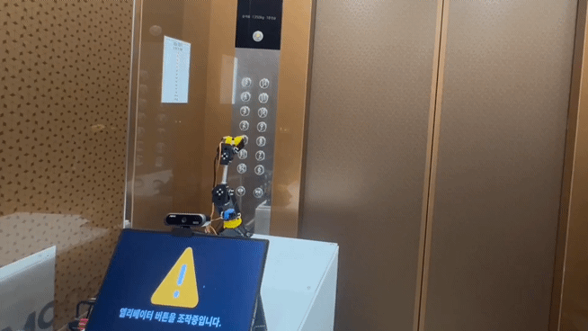

  <table>
    <tr>
      <td align="center">
         
      </td>
      <td align="center">
         
      </td>
      <td align="center">
         
      </td>
      <td align="center">
         
      </td>
    </tr>
  </table>

## 🎓 Education
- **KAIST** - Department of Electrical Engineering (Mar. 2018 - Present)

## 💼 Experience
- **Addinedu** — ROS2-based AI Robotics Program (Feb. 2025 - Oct. 2025)
- **LK ROBOTICS** — Robotics Software Engineer (Oct. 2025 - Present)

---

- 💼 **LinkedIn:** [linkedin.com/in/jinhyuk2me](https://www.linkedin.com/in/jinhyuk2me)  
- 📧 **Email:** [jinhyuk2me@gmail.com](mailto:jinhyuk2me@gmail.com)  

